# WavexPay – Flutter UI Task Submission

## Overview
WavexPay is a modern Flutter payment app UI inspired by Paytm, developed as part of a Flutter Developer selection task.  
It demonstrates UI/UX design, responsive layouts, and clean code structure built purely with Flutter .

## App Preview
| Splash Screen     | Login Screen   | Otp Screen |
| :-------------: | :-------------: | :---------------: |
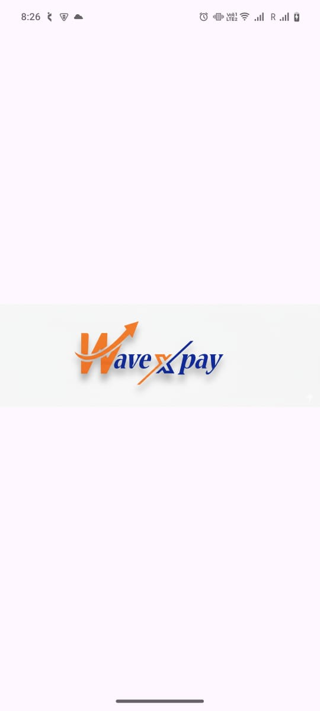| 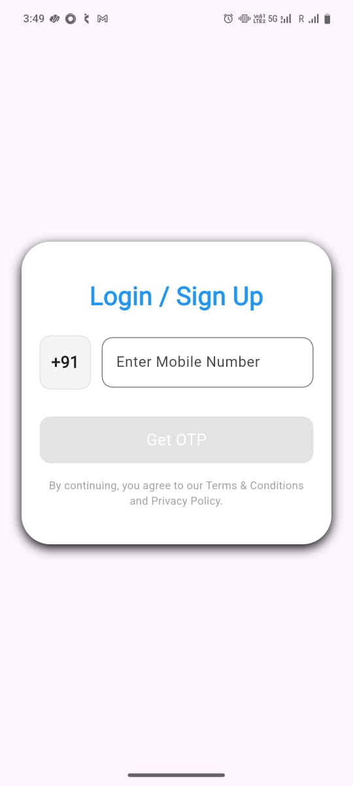|  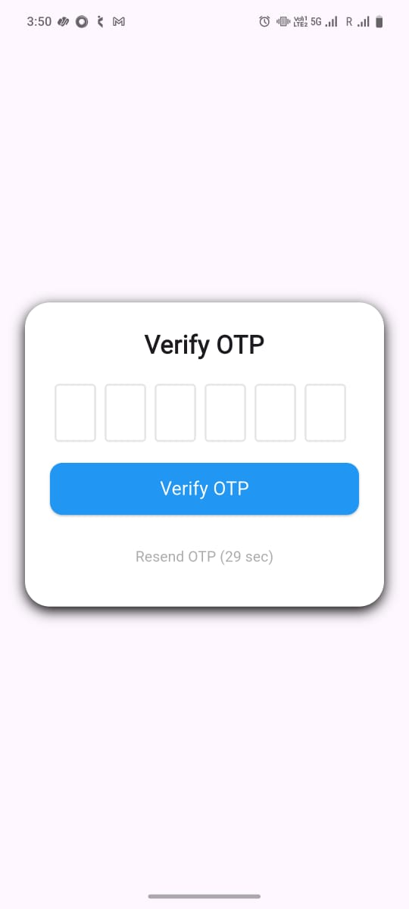 
| Home Screen     | Wallet Screen   | Offers Screen |
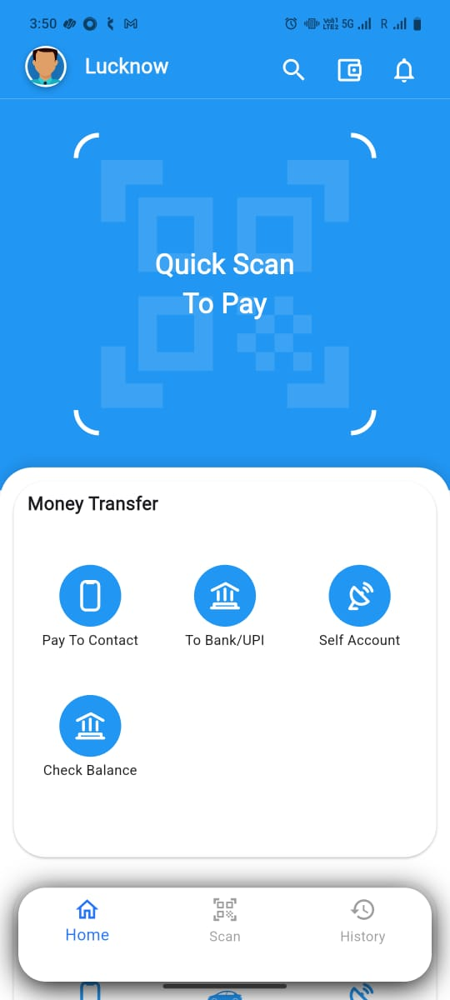| 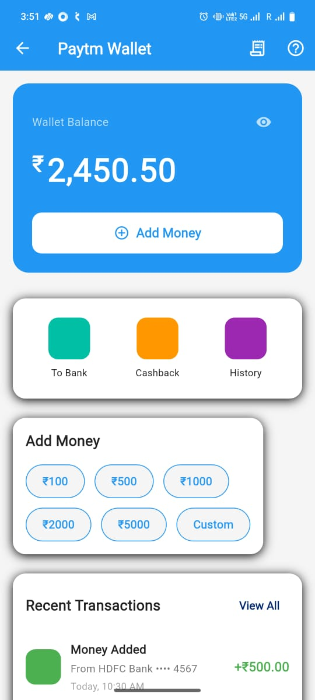 | 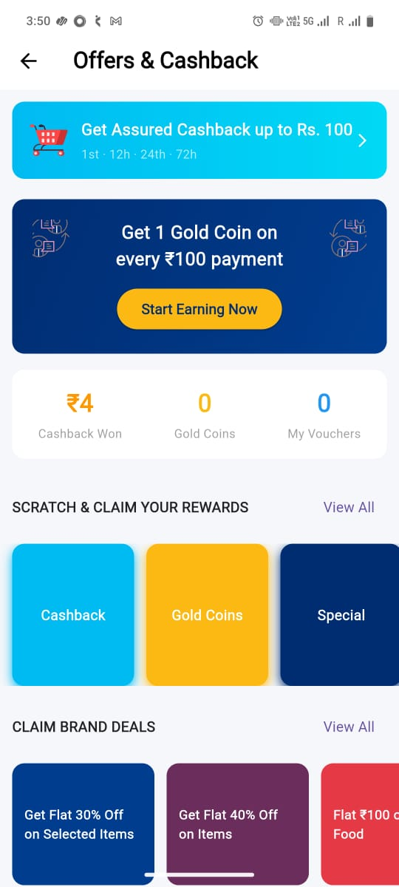  
| Sidebar     | Recharge Screen   | Scanner Screen |
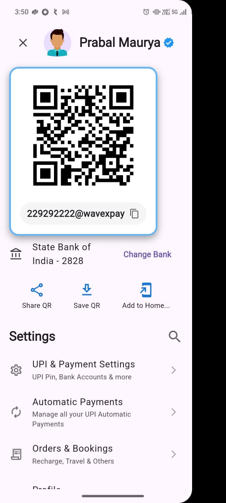 |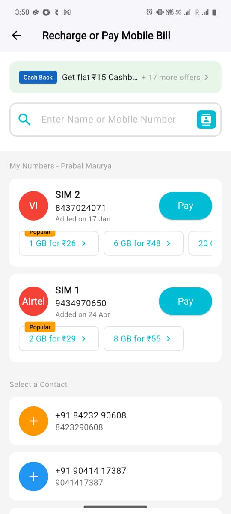 |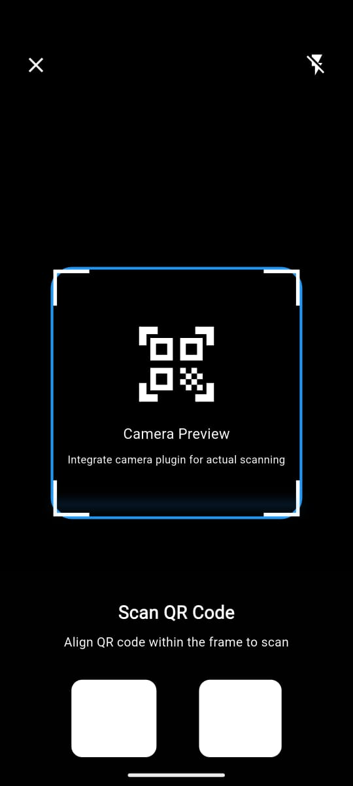 

| Search Screen   | BankTransfer Screen  | PhoneNoTransfer Screen |
| :-------------: | :-------------: | :-------------: |
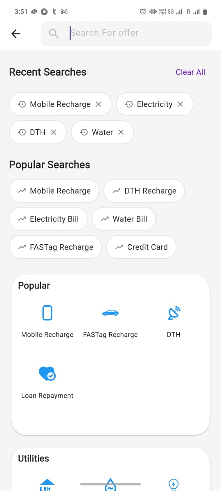 | 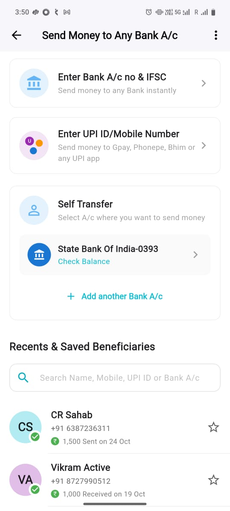 |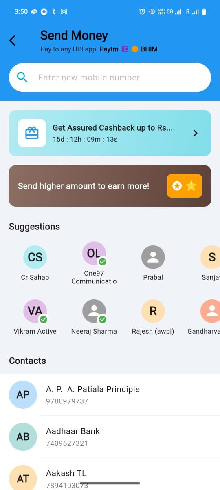 

| Notification Screen | Balance Screen|
| :-------------: | :-------------: | 
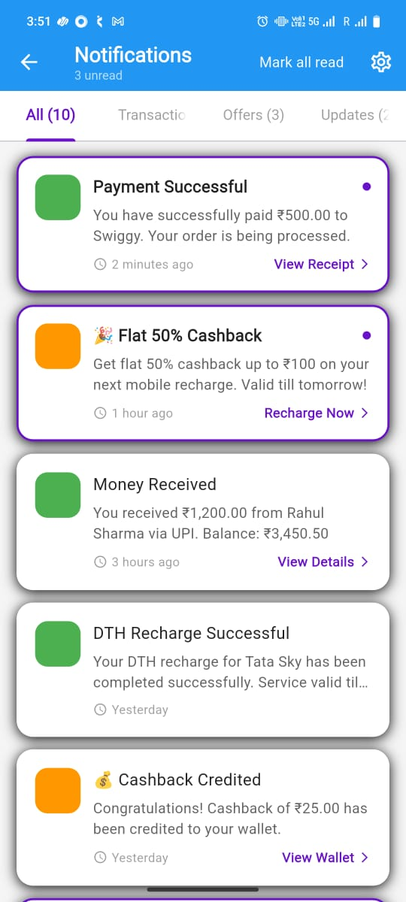 |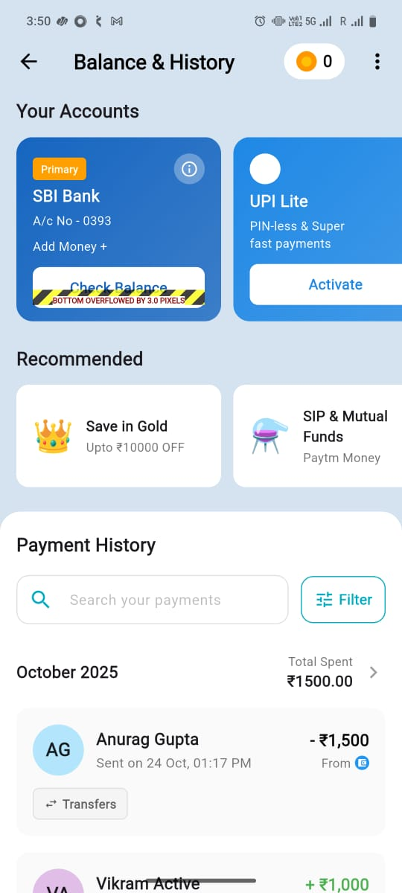 

## Objective
- Create a modern and intuitive Paytm-style payment UI.
- Build essential screens: Login, Home Dashboard, Wallet, and Recharge/Payment.
- Focus on clean, reusable widgets and maintainable architecture.

## Key Features (UI-Level)
- Login & Onboarding Flow
- Home Page with Wallet, Services, and Offers
- Pay to Contact / Pay via Bank Details
- Mobile Recharge Screen
- Transaction History & Balance Overview
- Cashback & Offer Section
- Notifications Panel
- Search Option

> **Note:** This project focuses on UI design and navigation only. No backend or API integrations are included.

## Design Decisions & Highlights
- **Component-Based Architecture:** Each visual element (cards, buttons, tiles) is a reusable widget.
- **Consistent Theming:** Custom color palette and typography ensure a unified look.
- **Responsive Layouts:** Implemented using `MediaQuery` and `LayoutBuilder`.
- **Smooth Navigation:** Clean and scalable route management.
- **Scalable Folder Setup:** Ready for future backend or state management integration.

## Setup Instructions
1. Clone the Repository
  ``` 
  git clone https://github.com/prabalmaurya08/wavexpay.git
  cd wavexpay
  ```

2. Install Dependencies
  ```
  flutter pub get
  ```

3. Run the App
``` 
  flutter run
```

4. (Optional) Build Release APK
  ```
  flutter build apk --release
  ```


## Tech Stack

| Tool        | Version             |
|-------------|---------------------|
| Flutter SDK | 3.35.4 (stable)     |
| Dart SDK    | 3.9.2               |
| DevTools    | 2.48.0              |
| Framework Revision | d693b4b9db |
| Supported Platforms | Android, iOS |

## Folder Structure
lib/
├── main.dart # Entry point
├── screens/ # App screens (Login, Home, Wallet, etc.)
├── widgets/ # Reusable UI components
├── models/ # Data model placeholders
├── utils/ # Colors, constants, and helpers
assets/
├── images/
├── icons/
└── fonts/


## Evaluation Notes
- ✅ Responsive layouts tested on multiple screen sizes  
- ✅ Organized and reusable widget structure  
- ✅ Consistent theme and typography  
- ✅ Ready for backend/API integration  
- ❌ UI-only (no real transactions or APIs)  

## Deliverables
- GitHub Repository: https://github.com/prabalmaurya08/wavexpay


## Developer
**Name:** Prabal  
**Role:** Flutter Developer (Assignment Submission)  
**Date:** November 2025
